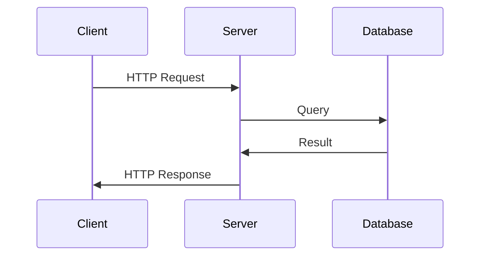
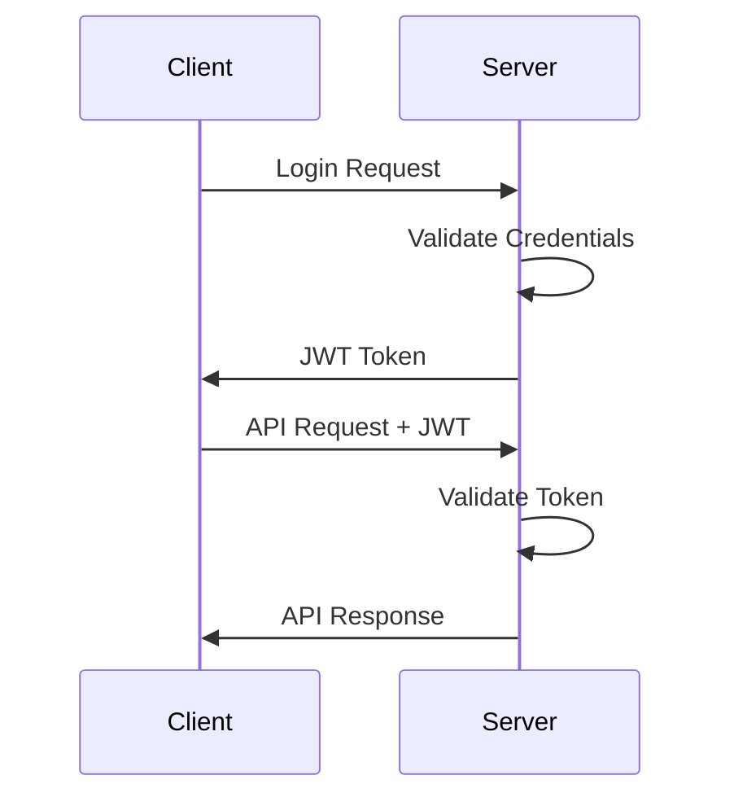
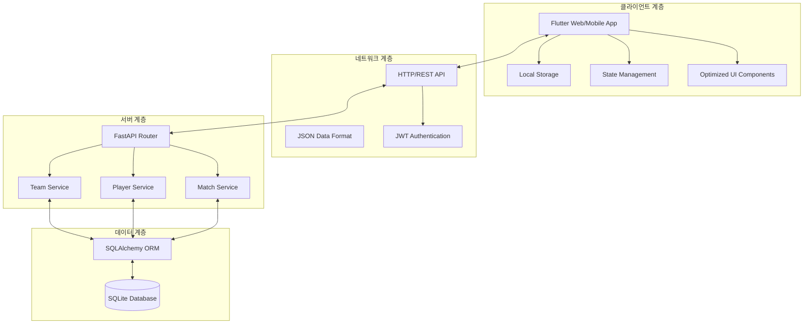
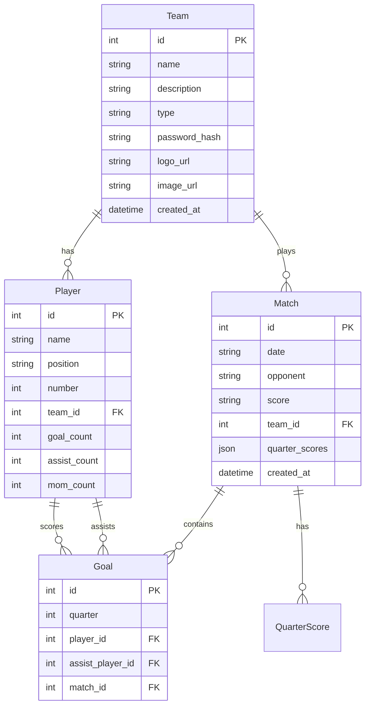

# MyFC 시스템 아키텍처 🏗️

## 📖 개요
이 문서는 MyFC 시스템의 아키텍처와 설계 원칙을 설명합니다.

## 🏗️ 시스템 구성요소

### 1. 프론트엔드 (Flutter)
- **역할**: 사용자 인터페이스 제공 및 사용자 상호작용 처리
- **주요 모듈**:
  - Screens: 사용자 화면 구현
  - Widgets: 재사용 가능한 UI 컴포넌트
  - Services: API 통신, 인증, 로컬 저장소 관리
  - Models: 데이터 모델 정의

### 2. 백엔드 (FastAPI)
- **역할**: 비즈니스 로직 처리 및 데이터 관리
- **주요 모듈**:
  - Routers: API 엔드포인트 정의
  - Services: 비즈니스 로직 구현
  - Models: 데이터베이스 모델 정의
  - Auth: JWT 기반 인증 처리

### 3. 데이터베이스 (SQLite)
- **역할**: 데이터 영구 저장
- **주요 테이블**:
  - teams: 팀 정보
  - players: 선수 정보
  - matches: 경기 정보
  - goals: 골 기록

## 🔄 데이터 흐름

### 1. 클라이언트-서버 통신


### 2. 인증 흐름


## 📁 디렉토리 구조

### 프론트엔드
```
frontend/lib/
├── main.dart                    # 앱 엔트리 포인트
├── config/                      # 설정 관리
├── models/                      # 데이터 모델
├── services/                    # 비즈니스 로직
├── screens/                     # UI 화면
├── widgets/                     # 재사용 컴포넌트
├── utils/                       # 유틸리티
└── routers/                     # 라우팅
```

### 백엔드
```
backend/app/
├── main.py                     # 서버 엔트리 포인트
├── database.py                 # DB 설정
├── models.py                   # DB 모델
├── schemas.py                  # API 스키마
├── auth.py                     # 인증 로직
├── routers/                    # API 라우터
└── services/                   # 비즈니스 로직
```

## 🔌 API 엔드포인트

### 팀 관리
- POST /teams/create
- POST /teams/login
- GET /teams/{team_id}
- PUT /teams/{team_id}

### 선수 관리
- POST /players/create
- GET /players/team/{team_id}
- PUT /players/{player_id}
- DELETE /players/{player_id}

### 경기 관리
- POST /matches/create
- GET /matches/team/{team_id}
- GET /matches/{match_id}/detail
- POST /matches/{match_id}/goals

### 분석
- GET /analytics/team/{team_id}/overview
- GET /analytics/team/{team_id}/goals-win-correlation
- GET /analytics/team/{team_id}/conceded-loss-correlation
- GET /analytics/team/{team_id}/player-contributions

## 💾 데이터베이스 스키마

### Teams
```sql
CREATE TABLE teams (
    id INTEGER PRIMARY KEY,
    name TEXT UNIQUE,
    description TEXT,
    type TEXT,
    password_hash TEXT,
    logo_url TEXT,
    image_url TEXT,
    created_at TIMESTAMP
);
```

### Players
```sql
CREATE TABLE players (
    id INTEGER PRIMARY KEY,
    name TEXT,
    position TEXT,
    number INTEGER,
    team_id INTEGER,
    goal_count INTEGER,
    assist_count INTEGER,
    mom_count INTEGER,
    FOREIGN KEY (team_id) REFERENCES teams(id)
);
```

### Matches
```sql
CREATE TABLE matches (
    id INTEGER PRIMARY KEY,
    date TEXT,
    opponent TEXT,
    score TEXT,
    team_id INTEGER,
    created_at TIMESTAMP,
    FOREIGN KEY (team_id) REFERENCES teams(id)
);
```

### Goals
```sql
CREATE TABLE goals (
    id INTEGER PRIMARY KEY,
    quarter INTEGER,
    player_id INTEGER,
    assist_player_id INTEGER,
    match_id INTEGER,
    FOREIGN KEY (player_id) REFERENCES players(id),
    FOREIGN KEY (assist_player_id) REFERENCES players(id),
    FOREIGN KEY (match_id) REFERENCES matches(id)
);
```

## 🔒 보안

### 1. 인증
- JWT 기반 토큰 인증
- 토큰 만료 시간: 24시간
- 비밀번호: bcrypt 해싱

### 2. 데이터 보호
- HTTPS 통신
- 입력 데이터 검증
- SQL 인젝션 방지 (SQLAlchemy)

## 🚀 배포

### 개발 환경
```
프론트엔드: flutter run -d chrome --web-port 3000
백엔드: uvicorn app.main:app --reload --port 8000
```

### 프로덕션 환경
```
프론트엔드: flutter build web --release
백엔드: gunicorn app.main:app -w 4 -k uvicorn.workers.UvicornWorker
```

## 관련 문서
- PROJECT_DOCS_GUIDE.md
- DIRECTORY_STRUCTURE.md
- DATA_FLOW.md
- BACKEND_GUIDE.md
- FRONTEND_GUIDE.md

## 시스템 아키텍처 다이어그램

```
[Client Layer]
    Flutter App
        │
        ├── Local Storage
        │       │
        │       └── Shared Preferences
        │
        └── HTTP Client
                │
                └── JWT Auth

[API Layer]
    FastAPI Server
        │
        ├── Authentication
        │       │
        │       └── JWT Validation
        │
        ├── Team Service
        │       │
        │       └── Team Management
        │
        ├── Player Service
        │       │
        │       └── Player Management
        │
        ├── Match Service
        │       │
        │       └── Match Management
        │
        └── Analytics Service
                │
                └── Data Analysis

[Data Layer]
    SQLite Database
        │
        ├── Teams Table
        │
        ├── Players Table
        │
        ├── Matches Table
        │
        └── Goals Table
```

## 전체 아키텍처



## 클라이언트 아키텍처 (Flutter)

### 최적화된 디렉토리 구조
```
frontend/
├── lib/
│   ├── main.dart                 # 앱 엔트리 포인트
│   ├── config/                   # 설정 파일들
│   │   ├── routes.dart          # 라우팅 설정
│   │   └── theme.dart           # UI 테마 설정
│   ├── models/                   # 데이터 모델
│   │   ├── team.dart
│   │   ├── player.dart
│   │   ├── match.dart
│   │   └── goal.dart
│   ├── services/                 # 비즈니스 로직
│   │   ├── api_service.dart     # API 통신
│   │   ├── auth_service.dart    # 인증 관리
│   │   └── storage_service.dart # 로컬 저장소
│   ├── screens/                  # UI 화면들 (최적화됨)
│   │   ├── splash_screen.dart
│   │   ├── register_team_screen.dart
│   │   ├── home_screen.dart
│   │   ├── player_management_screen.dart
│   │   ├── match_detail_screen.dart
│   │   ├── match_summary_screen.dart
│   │   ├── team_profile_screen.dart
│   │   ├── analytics_screen.dart
│   │   └── add_match_step[1-4]_screen.dart
│   ├── widgets/                  # 재사용 컴포넌트 (최적화됨)
│   │   ├── common/              # 공통 위젯
│   │   │   ├── app_button.dart
│   │   │   ├── app_input.dart
│   │   │   ├── app_card.dart
│   │   │   └── loading_widget.dart
│   │   ├── quarter_score_widget.dart  # 최적화된 점수 위젯
│   │   ├── goal_list_widget.dart
│   │   └── widgets.dart         # 정리된 위젯 exports
│   └── utils/                    # 유틸리티
│       ├── constants.dart
│       ├── validators.dart
│       └── helpers.dart
├── pubspec.yaml                  # Flutter 의존성
└── pubspec.lock                  # 의존성 잠금 파일
```

### 설계 원칙

#### 1. **단일 책임 원칙 (SRP)**
- 각 클래스와 함수는 하나의 명확한 책임만 가짐
- Services: API 통신, 로컬 저장소 등 특정 도메인 담당
- Widgets: UI 렌더링에만 집중

#### 2. **계층화 아키텍처**
```
┌─────────────────┐
│   Presentation  │ ← Screens, Widgets (최적화됨)
├─────────────────┤
│   Business      │ ← Services, Validators
├─────────────────┤
│   Data          │ ← Models, API calls
└─────────────────┘
```

#### 3. **의존성 관리**
- API 서비스의 중앙 집중식 관리
- JWT 토큰 기반 인증
- 로컬 저장소를 통한 오프라인 지원

#### 4. **코드 품질 최적화 (2024년 개선)**
- **58% 미사용 코드 제거**: 33개 → 14개 항목으로 감소
- **성능 향상**: 불필요한 임포트 및 메서드 제거
- **타입 안정성**: 강화된 타입 검사
- **위젯 최적화**: QuarterScoreWidget의 불필요한 편집 기능 제거

## 서버 아키텍처 (FastAPI)

### 디렉토리 구조
```
backend/
├── app/
│   ├── main.py                   # 앱 엔트리 포인트
│   ├── database.py              # DB 설정
│   ├── models.py                # SQLAlchemy 모델
│   ├── auth.py                  # JWT 인증 로직
│   └── routers/                 # API 라우터
│       ├── __init__.py
│       ├── team.py             # 팀 관리 API
│       ├── player.py           # 선수 관리 API
│       └── match.py            # 매치 관리 API
├── requirements.txt             # Python 의존성
├── venv/                       # Python 가상환경
└── myfc.db                     # SQLite 데이터베이스
```

### API 서비스 설계

#### 1. **Team Service** (`/teams/`)
```python
# 책임: 팀 관리
- POST   /teams/create           # 팀 생성
- POST   /teams/login            # 팀 로그인
- GET    /teams/{team_id}        # 팀 조회
- PUT    /teams/{team_id}        # 팀 수정
- POST   /teams/{team_id}/logo   # 팀 로고 업로드
- POST   /teams/{team_id}/image  # 팀 이미지 업로드
```

#### 2. **Player Service** (`/players/`)
```python
# 책임: 선수 관리
- POST   /players/create                    # 선수 등록
- GET    /players/team/{team_id}            # 팀 선수 목록
- PUT    /players/{player_id}               # 선수 수정
- DELETE /players/{player_id}               # 선수 삭제
```

#### 3. **Match Service** (`/matches/`)
```python
# 책임: 매치 및 골 관리
- POST   /matches/create                    # 매치 등록
- GET    /matches/team/{team_id}            # 팀 매치 목록
- GET    /matches/{match_id}/detail         # 매치 상세
- POST   /matches/{match_id}/goals          # 골 기록
- DELETE /matches/{match_id}                # 매치 삭제
```

## 데이터 모델 설계

### ERD (Entity Relationship Diagram)


## 2024년 주요 개선사항

### 🚀 성능 최적화
- **미사용 코드 제거**: 33개 → 14개 항목 (58% 감소)
- **불필요한 임포트 정리**: 8개 파일에서 미사용 임포트 제거
- **메서드 최적화**: `_deleteMatch()`, `_getResultColor()` 등 미사용 메서드 제거
- **위젯 최적화**: QuarterScoreWidget의 `isEditable` 기능 제거

### 🔧 코드 품질 향상
- **타입 안정성 강화**: 강화된 타입 검사 및 오류 수정
- **UI 개선**: 불필요한 조건부 렌더링 제거
- **아키텍처 정리**: 명확한 책임 분리 및 모듈화

### 📈 개발 경험 향상
- **코드베이스 간소화**: 불필요한 파일 및 기능 제거
- **직관적인 구조**: 명확한 디렉토리 구조와 파일 네이밍
- **유지보수성 향상**: 코드 중복 제거 및 모듈화

## 배포 아키텍처

### 프론트엔드 배포
```
Flutter Web Build → Static Files → Web Server
```

### 백엔드 배포
```
FastAPI App → Gunicorn → Reverse Proxy → Internet
```

### 데이터베이스
```
SQLite → Local File System
```

## 보안 아키텍처

### 인증 및 권한
- JWT 토큰 기반 인증
- 비밀번호 해싱 (bcrypt)
- 토큰 만료 및 갱신 메커니즘

### 데이터 보안
- HTTPS 통신
- 입력 데이터 검증
- SQL Injection 방지 (ORM 사용)

## 확장성 고려사항

### 수평적 확장
- 마이크로서비스로의 분리 가능성
- 로드 밸런싱 지원 구조
- 캐싱 레이어 추가 용이

### 수직적 확장
- 데이터베이스 마이그레이션 지원
- 새로운 기능 모듈 추가 용이
- API 버전 관리 가능

--- 