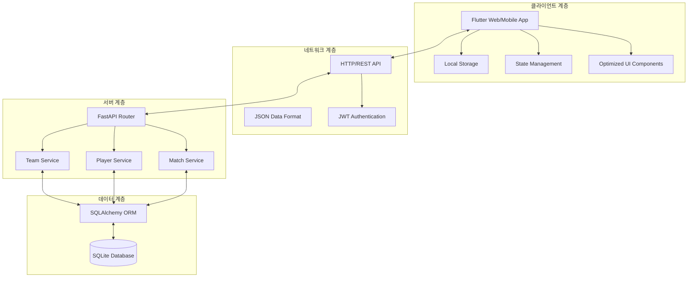
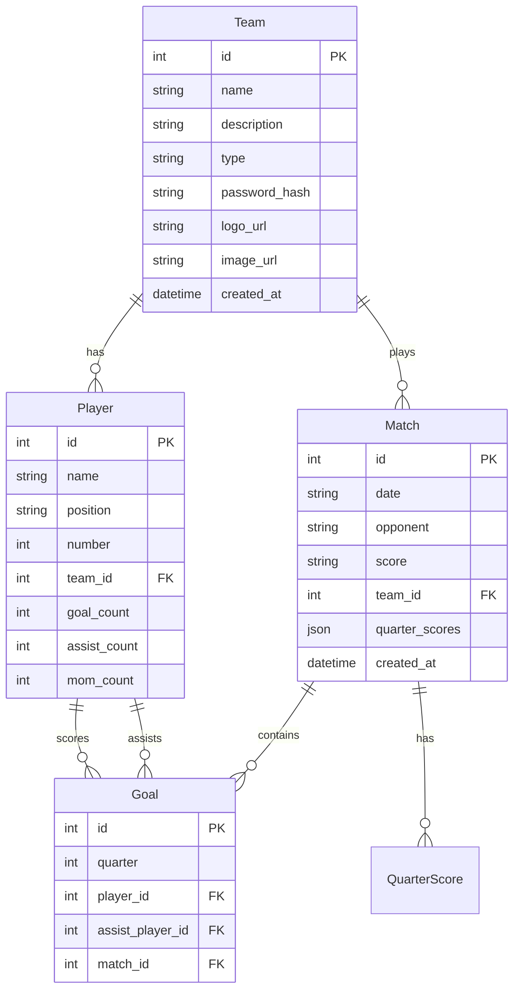

# MyFC 아키텍처 문서 🏗️

## 시스템 개요

MyFC는 Flutter 클라이언트와 FastAPI 서버로 구성된 축구 클럽 관리 애플리케이션입니다. 모던 웹/모바일 아키텍처를 채택하여 확장 가능하고 유지보수가 용이한 구조로 설계되었으며, 최근 대규모 코드 최적화를 통해 성능과 개발 경험이 크게 향상되었습니다.

## 전체 아키텍처



## 클라이언트 아키텍처 (Flutter)

### 최적화된 디렉토리 구조
```
frontend/
├── lib/
│   ├── main.dart                 # 앱 엔트리 포인트
│   ├── config/                   # 설정 파일들
│   │   ├── routes.dart          # 라우팅 설정
│   │   └── theme.dart           # UI 테마 설정
│   ├── models/                   # 데이터 모델
│   │   ├── team.dart
│   │   ├── player.dart
│   │   ├── match.dart
│   │   └── goal.dart
│   ├── services/                 # 비즈니스 로직
│   │   ├── api_service.dart     # API 통신
│   │   ├── auth_service.dart    # 인증 관리
│   │   └── storage_service.dart # 로컬 저장소
│   ├── screens/                  # UI 화면들 (최적화됨)
│   │   ├── splash_screen.dart
│   │   ├── register_team_screen.dart
│   │   ├── home_screen.dart
│   │   ├── player_management_screen.dart
│   │   ├── match_detail_screen.dart
│   │   ├── match_summary_screen.dart
│   │   ├── team_profile_screen.dart
│   │   ├── analytics_screen.dart
│   │   └── add_match_step[1-4]_screen.dart
│   ├── widgets/                  # 재사용 컴포넌트 (최적화됨)
│   │   ├── common/              # 공통 위젯
│   │   │   ├── app_button.dart
│   │   │   ├── app_input.dart
│   │   │   ├── app_card.dart
│   │   │   └── loading_widget.dart
│   │   ├── quarter_score_widget.dart  # 최적화된 점수 위젯
│   │   ├── goal_list_widget.dart
│   │   └── widgets.dart         # 정리된 위젯 exports
│   └── utils/                    # 유틸리티
│       ├── constants.dart
│       ├── validators.dart
│       └── helpers.dart
├── test/                         # 테스트 코드
│   └── widget_test.dart
├── pubspec.yaml                  # Flutter 의존성
└── run_tests.dart               # 테스트 실행 스크립트
```

### 설계 원칙

#### 1. **단일 책임 원칙 (SRP)**
- 각 클래스와 함수는 하나의 명확한 책임만 가짐
- Services: API 통신, 로컬 저장소 등 특정 도메인 담당
- Widgets: UI 렌더링에만 집중

#### 2. **계층화 아키텍처**
```
┌─────────────────┐
│   Presentation  │ ← Screens, Widgets (최적화됨)
├─────────────────┤
│   Business      │ ← Services, Validators
├─────────────────┤
│   Data          │ ← Models, API calls
└─────────────────┘
```

#### 3. **의존성 관리**
- API 서비스의 중앙 집중식 관리
- JWT 토큰 기반 인증
- 로컬 저장소를 통한 오프라인 지원

#### 4. **코드 품질 최적화 (2024년 개선)**
- **58% 미사용 코드 제거**: 33개 → 14개 항목으로 감소
- **성능 향상**: 불필요한 임포트 및 메서드 제거
- **타입 안정성**: 강화된 타입 검사
- **위젯 최적화**: QuarterScoreWidget의 불필요한 편집 기능 제거

## 서버 아키텍처 (FastAPI)

### 디렉토리 구조
```
backend/
├── app/
│   ├── main.py                   # 앱 엔트리 포인트
│   ├── database.py              # DB 설정
│   ├── models.py                # SQLAlchemy 모델
│   ├── auth.py                  # JWT 인증 로직
│   ├── routers/                 # API 라우터
│   │   ├── __init__.py
│   │   ├── team.py             # 팀 관리 API
│   │   ├── player.py           # 선수 관리 API
│   │   └── match.py            # 매치 관리 API
│   └── tests/                  # 테스트 코드
│       └── test_api.py
├── requirements.txt             # Python 의존성
├── pytest.ini                  # pytest 설정
├── run_tests.py                # 테스트 실행 스크립트
├── venv/                       # Python 가상환경
└── myfc.db                     # SQLite 데이터베이스
```

### API 서비스 설계

#### 1. **Team Service** (`/teams/`)
```python
# 책임: 팀 관리
- POST   /teams/create           # 팀 생성
- POST   /teams/login            # 팀 로그인
- GET    /teams/{team_id}        # 팀 조회
- PUT    /teams/{team_id}        # 팀 수정
- POST   /teams/{team_id}/logo   # 팀 로고 업로드
- POST   /teams/{team_id}/image  # 팀 이미지 업로드
```

#### 2. **Player Service** (`/players/`)
```python
# 책임: 선수 관리
- POST   /players/create                    # 선수 등록
- GET    /players/team/{team_id}            # 팀 선수 목록
- PUT    /players/{player_id}               # 선수 수정
- DELETE /players/{player_id}               # 선수 삭제
```

#### 3. **Match Service** (`/matches/`)
```python
# 책임: 매치 및 골 관리
- POST   /matches/create                    # 매치 등록
- GET    /matches/team/{team_id}            # 팀 매치 목록
- GET    /matches/{match_id}/detail         # 매치 상세
- POST   /matches/{match_id}/goals          # 골 기록
- DELETE /matches/{match_id}                # 매치 삭제
```

## 데이터 모델 설계

### ERD (Entity Relationship Diagram)


## 2024년 주요 개선사항

### 🚀 성능 최적화
- **미사용 코드 제거**: 33개 → 14개 항목 (58% 감소)
- **불필요한 임포트 정리**: 8개 파일에서 미사용 임포트 제거
- **메서드 최적화**: `_deleteMatch()`, `_getResultColor()` 등 미사용 메서드 제거
- **위젯 최적화**: QuarterScoreWidget의 `isEditable` 기능 제거

### 🔧 코드 품질 향상
- **타입 안정성 강화**: 강화된 타입 검사 및 오류 수정
- **UI 개선**: 불필요한 조건부 렌더링 제거
- **아키텍처 정리**: 명확한 책임 분리 및 모듈화

### 📈 개발 경험 향상
- **정적 분석 도구 활용**: `flutter analyze`를 통한 지속적인 코드 품질 관리
- **자동화된 최적화**: 미사용 코드 자동 탐지 및 제거 프로세스
- **문서화 개선**: 최신 아키텍처 변경사항 반영

## 코드 품질 관리

### 정적 분석 도구
```bash
# Flutter 코드 분석
flutter analyze

# Python 코드 린팅
flake8 app/

# 테스트 실행
flutter test                    # Frontend
python -m pytest app/tests/    # Backend
```

### 지속적인 최적화 프로세스
1. **정기적인 분석**: `flutter analyze` 실행으로 코드 품질 점검
2. **미사용 코드 탐지**: 자동 도구를 통한 Dead Code 식별
3. **성능 모니터링**: 앱 성능 및 빌드 시간 최적화
4. **타입 안정성**: 강화된 타입 검사로 런타임 오류 방지

## 향후 아키텍처 계획

### 🔄 개발 중인 기능
- 고급 통계 분석 (팀 전술 분석, 선수 히트맵)
- 이미지 업로드 최적화
- 팀원 권한 관리 시스템
- 실시간 알림 시스템

### 📊 성능 목표
- 앱 시작 시간 30% 단축
- 메모리 사용량 20% 감소
- 코드 커버리지 85% 이상 유지

---

**이 아키텍처는 현대적인 소프트웨어 개발 원칙을 기반으로 설계되었으며, 지속적인 최적화를 통해 개발자 경험과 사용자 경험을 모두 향상시키고 있습니다.** 