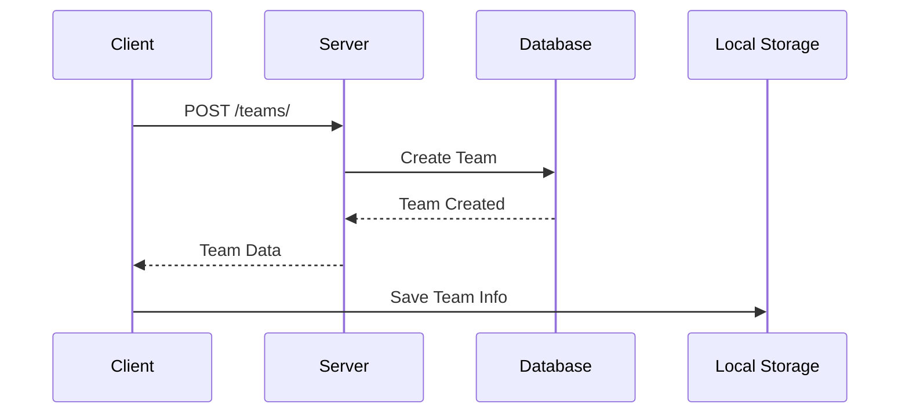
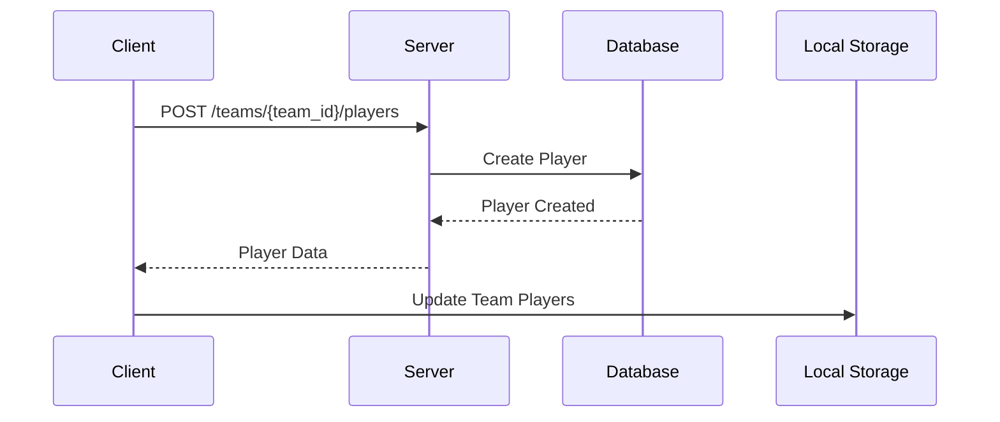
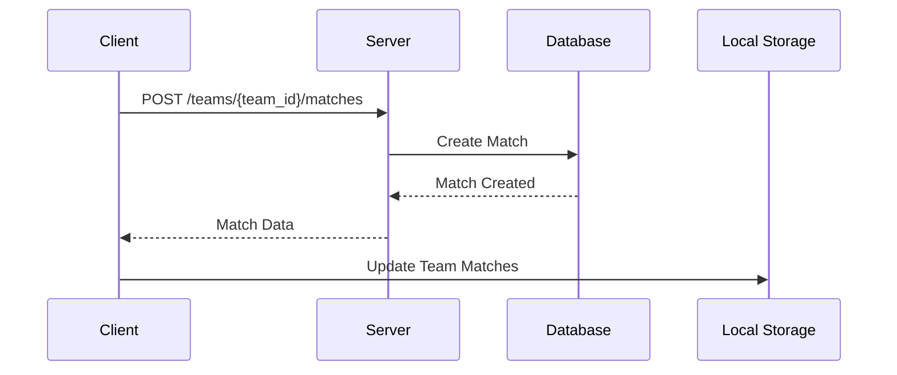
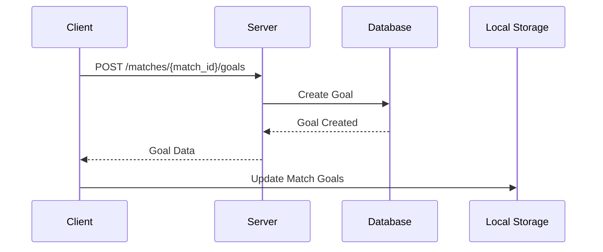
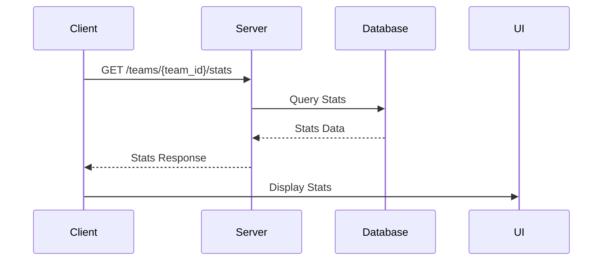
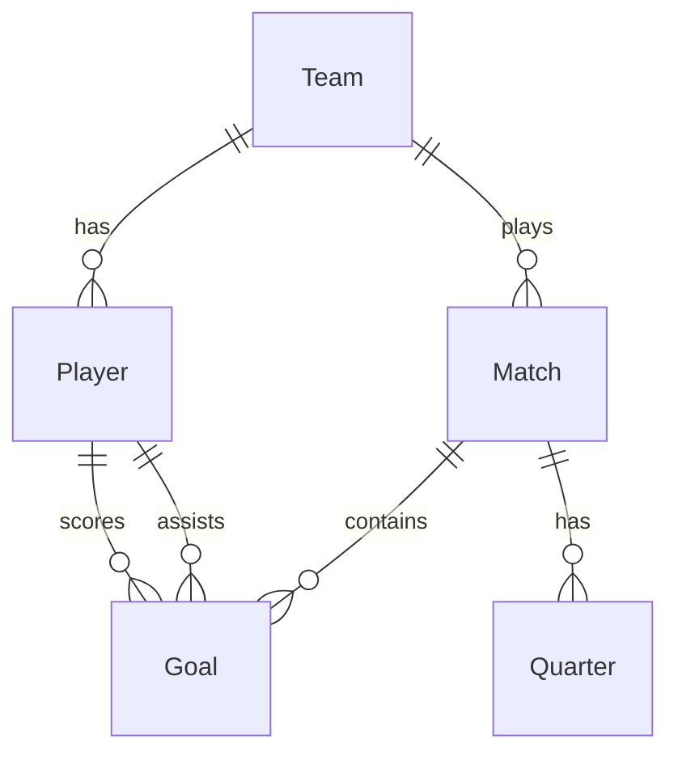

# MyFC 클라이언트-서버 데이터 흐름 📊

## 📱 클라이언트 (Flutter) 관리 정보

### 1. 팀 정보
- 팀 ID
- 팀 이름
- 팀 로고
- 팀 색상
- 팀 선수 목록
- 팀 매치 기록

### 2. 선수 정보
- 선수 ID
- 선수 이름
- 선수 번호
- 선수 포지션
- 선수 통계
  - 득점
  - 도움
  - 출전 경기 수

### 3. 매치 정보
- 매치 ID
- 매치 날짜
- 매치 시간
- 매치 장소
- 매치 상대팀
- 매치 결과
  - 쿼터별 점수
  - 최종 점수
- 골 기록
  - 득점자
  - 도움
  - 시간
  - 쿼터

### 4. 분석 정보
- 팀 통계
  - 시즌 득점
  - 시즌 실점
  - 승/무/패
- 선수 통계
  - 득점 순위
  - 도움 순위
  - 출전 순위

## 🖥️ 서버 (FastAPI) 관리 정보

### 1. 데이터베이스 모델
```python
class Team(Base):
    __tablename__ = "teams"
    id = Column(Integer, primary_key=True)
    name = Column(String, unique=True)
    logo = Column(String)
    color = Column(String)
    players = relationship("Player", back_populates="team")
    matches = relationship("Match", back_populates="team")

class Player(Base):
    __tablename__ = "players"
    id = Column(Integer, primary_key=True)
    name = Column(String)
    number = Column(Integer)
    position = Column(String)
    team_id = Column(Integer, ForeignKey("teams.id"))
    team = relationship("Team", back_populates="players")
    goals = relationship("Goal", back_populates="scorer")

class Match(Base):
    __tablename__ = "matches"
    id = Column(Integer, primary_key=True)
    date = Column(Date)
    time = Column(Time)
    location = Column(String)
    opponent = Column(String)
    team_id = Column(Integer, ForeignKey("teams.id"))
    team = relationship("Team", back_populates="matches")
    goals = relationship("Goal", back_populates="match")
    quarters = relationship("Quarter", back_populates="match")

class Goal(Base):
    __tablename__ = "goals"
    id = Column(Integer, primary_key=True)
    match_id = Column(Integer, ForeignKey("matches.id"))
    scorer_id = Column(Integer, ForeignKey("players.id"))
    assist_id = Column(Integer, ForeignKey("players.id"))
    quarter = Column(Integer)
    time = Column(Integer)
    match = relationship("Match", back_populates="goals")
    scorer = relationship("Player", foreign_keys=[scorer_id])
    assist = relationship("Player", foreign_keys=[assist_id])

class Quarter(Base):
    __tablename__ = "quarters"
    id = Column(Integer, primary_key=True)
    match_id = Column(Integer, ForeignKey("matches.id"))
    quarter_number = Column(Integer)
    team_score = Column(Integer)
    opponent_score = Column(Integer)
    match = relationship("Match", back_populates="quarters")
```

### 2. API 엔드포인트

#### 팀 관리
- `GET /teams/` - 팀 목록 조회
- `POST /teams/` - 팀 생성
- `GET /teams/{team_id}` - 팀 상세 정보
- `PUT /teams/{team_id}` - 팀 정보 수정
- `DELETE /teams/{team_id}` - 팀 삭제

#### 선수 관리
- `GET /teams/{team_id}/players` - 팀 선수 목록
- `POST /teams/{team_id}/players` - 선수 추가
- `GET /players/{player_id}` - 선수 상세 정보
- `PUT /players/{player_id}` - 선수 정보 수정
- `DELETE /players/{player_id}` - 선수 삭제

#### 매치 관리
- `GET /teams/{team_id}/matches` - 팀 매치 목록
- `POST /teams/{team_id}/matches` - 매치 생성
- `GET /matches/{match_id}` - 매치 상세 정보
- `PUT /matches/{match_id}` - 매치 정보 수정
- `DELETE /matches/{match_id}` - 매치 삭제

#### 골 관리
- `GET /matches/{match_id}/goals` - 매치 골 목록
- `POST /matches/{match_id}/goals` - 골 추가
- `PUT /goals/{goal_id}` - 골 정보 수정
- `DELETE /goals/{goal_id}` - 골 삭제

#### 분석
- `GET /teams/{team_id}/stats` - 팀 통계
- `GET /teams/{team_id}/players/stats` - 선수 통계

## 🔄 데이터 흐름

### 1. 팀 등록


### 2. 선수 추가


### 3. 매치 등록


### 4. 골 기록


### 5. 통계 조회


## 📊 엔티티 관계도



## 🔒 데이터 보안

### 1. 인증
- JWT 기반 인증
- 토큰 만료 시간 설정
- 리프레시 토큰 지원

### 2. 데이터 검증
- Pydantic 모델을 통한 입력 검증
- SQLAlchemy를 통한 데이터 무결성 보장
- 클라이언트 측 입력 검증

### 3. 에러 처리
- HTTP 상태 코드 표준 준수
- 상세한 에러 메시지
- 클라이언트 에러 핸들링

## 📈 성능 최적화

### 1. 캐싱
- 클라이언트 로컬 스토리지 활용
- 서버 측 캐싱 (Redis)
- HTTP 캐시 헤더 활용

### 2. 데이터베이스
- 인덱스 최적화
- 쿼리 최적화
- 연결 풀링

### 3. API 응답
- 페이지네이션
- 데이터 압축
- 필요한 필드만 선택적 조회 