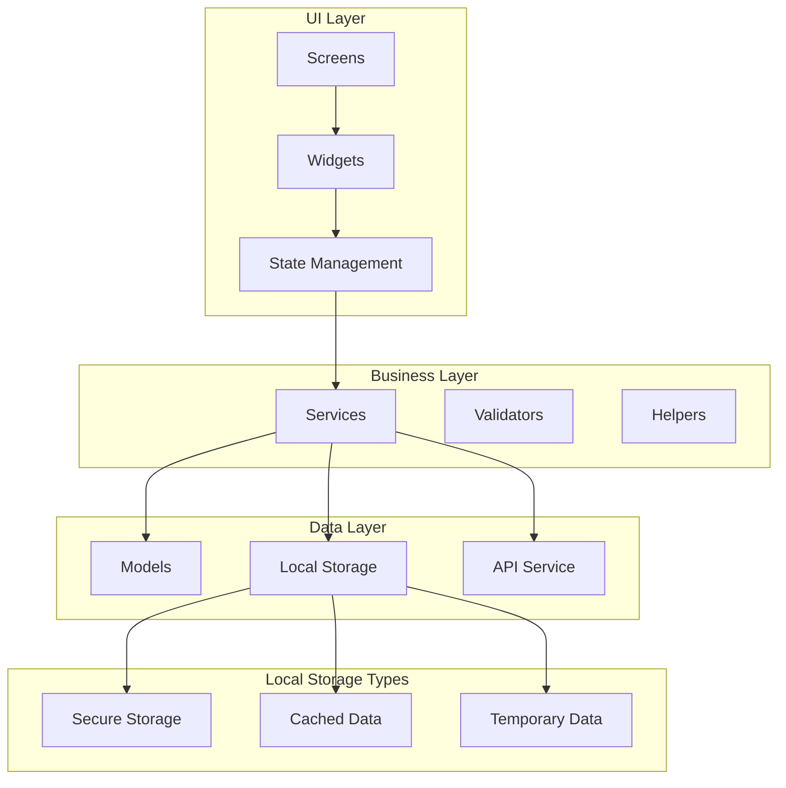
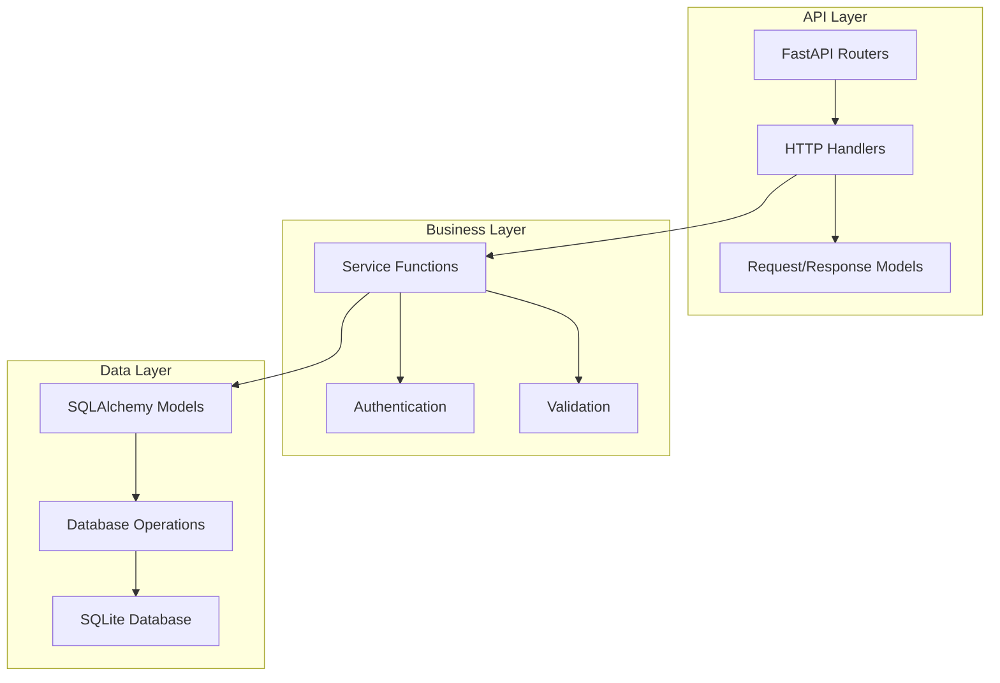
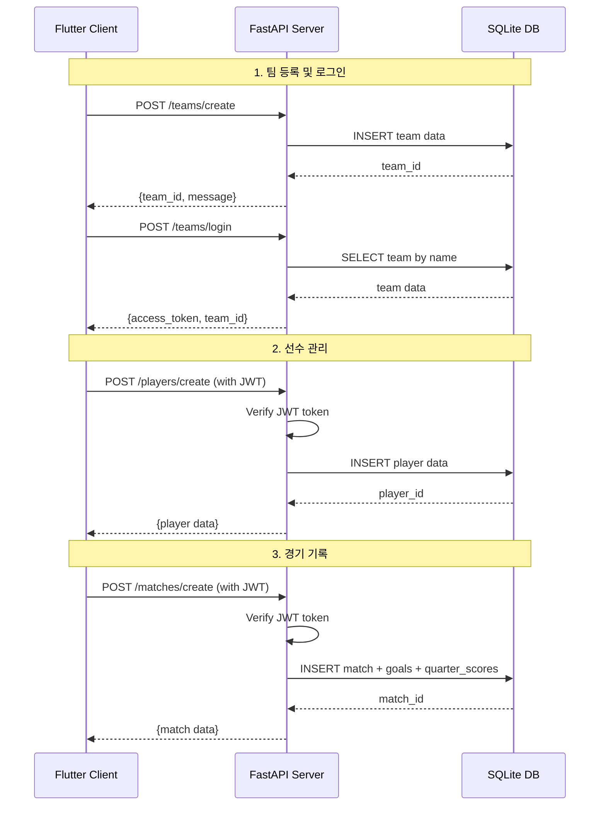
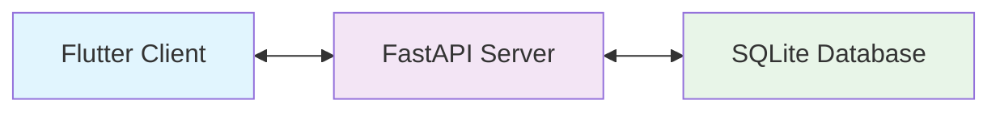
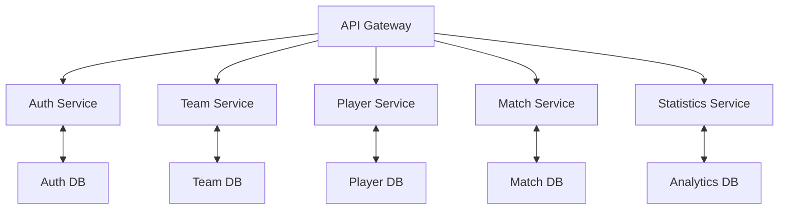
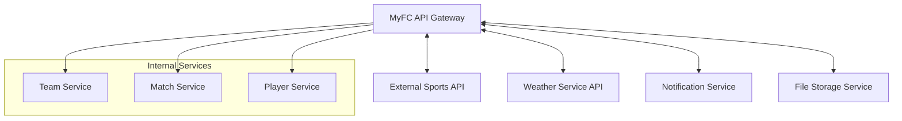

# MyFC 데이터 플로우 및 API 명세서 📊

본 문서는 MyFC 애플리케이션의 데이터 관리 구조와 클라이언트-서버 간 통신 명세를 상세히 설명합니다.

## 📋 목차

1. [클라이언트 데이터 관리 구조](#1-클라이언트-데이터-관리-구조)
2. [서버 데이터 관리 구조](#2-서버-데이터-관리-구조)
3. [클라이언트-서버 통신 (REST API)](#3-클라이언트-서버-통신-rest-api)
4. [서버-서버 통신](#4-서버-서버-통신)

---

## 1. 클라이언트 데이터 관리 구조

### 📱 Flutter 클라이언트 데이터 아키텍처



### 🗂️ 클라이언트 데이터 구조 상세

#### **Models (데이터 모델)**
```
frontend/lib/models/
├── team.dart          # 팀 정보 모델
├── player.dart        # 선수 정보 모델
├── match.dart         # 경기 정보 모델
└── goal.dart          # 골 정보 모델
```

**Team Model**
```dart
class Team {
  final int id;
  final String name;
  final String description;
  final String type;
  final String? logoUrl;
  final String? imageUrl;
  final DateTime createdAt;
}
```

**Player Model**
```dart
class Player {
  final int id;
  final String name;
  final String position;
  final int number;
  final int teamId;
  final int goalCount;
  final int assistCount;
  final int momCount;
}
```

**Match Model**
```dart
class Match {
  final int id;
  final String date;
  final String opponent;
  final String score;
  final Map<int, QuarterScore>? quarterScores;
  final List<Goal>? goals;
}
```

#### **Services (비즈니스 로직)**
```
frontend/lib/services/
├── api_service.dart      # API 통신 관리
├── auth_service.dart     # 인증 상태 관리
└── storage_service.dart  # 로컬 데이터 저장소
```

**API Service 구조**
```dart
class ApiService {
  // Team 관련 API
  Future<Team> createTeam(String name, String description, String type, String password);
  Future<Map<String, dynamic>> loginTeam(String name, String password);
  Future<Team> getTeam(int teamId, String token);
  
  // Player 관련 API
  Future<Player> createPlayer(String name, String position, int number, int teamId, String token);
  Future<List<Player>> getTeamPlayers(int teamId, String token);
  
  // Match 관련 API
  Future<Match> createMatch(Map<String, dynamic> matchData, String token);
  Future<List<Match>> getTeamMatches(int teamId, String? token);
}
```

#### **Local Storage (로컬 저장소)**
```dart
class StorageService {
  // 보안 저장소 (JWT 토큰, 팀 ID)
  Future<void> saveToken(String token);
  Future<void> saveTeamId(String teamId);
  
  // 캐시 저장소 (API 응답 캐싱)
  Future<void> cacheTeam(Team team);
  Future<void> cachePlayers(List<Player> players);
  Future<void> cacheMatches(List<Match> matches);
  
  // 임시 저장소 (매치 등록 과정)
  Map<String, dynamic> tempMatchData = {};
}
```

---

## 2. 서버 데이터 관리 구조

### 🖥️ FastAPI 서버 데이터 아키텍처



### 🗄️ 서버 데이터 구조 상세

#### **Database Models (SQLAlchemy)**
```
backend/app/models.py
```

**Team Model**
```python
class Team(Base):
    __tablename__ = "teams"
    
    id = Column(Integer, primary_key=True, index=True)
    name = Column(String, unique=True, index=True)
    description = Column(String)
    type = Column(String)  # "축구", "풋살", "축구/풋살"
    password_hash = Column(String)
    logo_url = Column(String, nullable=True)
    image_url = Column(String, nullable=True)
    created_at = Column(DateTime, default=datetime.utcnow)
    
    # Relationships
    players = relationship("Player", back_populates="team")
    matches = relationship("Match", back_populates="team")
```

**Player Model**
```python
class Player(Base):
    __tablename__ = "players"
    
    id = Column(Integer, primary_key=True, index=True)
    name = Column(String, index=True)
    position = Column(String)
    number = Column(Integer)
    team_id = Column(Integer, ForeignKey("teams.id"))
    goal_count = Column(Integer, default=0)
    assist_count = Column(Integer, default=0)
    mom_count = Column(Integer, default=0)
    
    # Relationships
    team = relationship("Team", back_populates="players")
    goals = relationship("Goal", foreign_keys="Goal.player_id", back_populates="player")
    assists = relationship("Goal", foreign_keys="Goal.assist_player_id", back_populates="assist_player")
```

**Match Model**
```python
class Match(Base):
    __tablename__ = "matches"
    
    id = Column(Integer, primary_key=True, index=True)
    date = Column(String)
    opponent = Column(String)
    score = Column(String)
    team_id = Column(Integer, ForeignKey("teams.id"))
    created_at = Column(DateTime, default=datetime.utcnow)
    
    # Relationships
    team = relationship("Team", back_populates="matches")
    goals = relationship("Goal", back_populates="match")
    quarter_scores = relationship("QuarterScore", back_populates="match")
```

#### **API Routers (엔드포인트 구조)**
```
backend/app/routers/
├── team.py          # 팀 관련 API
├── player.py        # 선수 관련 API
└── match.py         # 경기 관련 API
```

---

## 3. 클라이언트-서버 통신 (REST API)

### 🔄 API 통신 플로우



### 📡 REST API 명세서

#### **Team Management APIs**

**1. 팀 생성**
```http
POST /teams/create
Content-Type: application/json

{
  "name": "FC UBUNTU",
  "description": "우분투 축구 클럽",
  "type": "축구",
  "password": "secure_password"
}

Response 201:
{
  "id": 1,
  "name": "FC UBUNTU",
  "description": "우분투 축구 클럽",
  "type": "축구",
  "created_at": "2024-01-01T00:00:00Z"
}
```

**2. 팀 로그인**
```http
POST /teams/login
Content-Type: application/json

{
  "name": "FC UBUNTU",
  "password": "secure_password"
}

Response 200:
{
  "access_token": "eyJhbGciOiJIUzI1NiIsInR5cCI6IkpXVCJ9...",
  "token_type": "bearer",
  "team_id": 1
}
```

**3. 팀 정보 조회**
```http
GET /teams/{team_id}
Authorization: Bearer {access_token}

Response 200:
{
  "id": 1,
  "name": "FC UBUNTU",
  "description": "우분투 축구 클럽",
  "type": "축구",
  "logo_url": "https://example.com/logo.png",
  "image_url": "https://example.com/team.jpg",
  "created_at": "2024-01-01T00:00:00Z"
}
```

#### **Player Management APIs**

**1. 선수 등록**
```http
POST /players/create
Authorization: Bearer {access_token}
Content-Type: application/json

{
  "name": "김민수",
  "position": "FW",
  "number": 10,
  "team_id": 1
}

Response 201:
{
  "id": 1,
  "name": "김민수",
  "position": "FW", 
  "number": 10,
  "team_id": 1,
  "goal_count": 0,
  "assist_count": 0,
  "mom_count": 0
}
```

**2. 팀 선수 목록 조회**
```http
GET /players/team/{team_id}
Authorization: Bearer {access_token}

Response 200:
[
  {
    "id": 1,
    "name": "김민수",
    "position": "FW",
    "number": 10,
    "team_id": 1,
    "goal_count": 5,
    "assist_count": 3,
    "mom_count": 2
  },
  {
    "id": 2,
    "name": "이영희",
    "position": "MF", 
    "number": 8,
    "team_id": 1,
    "goal_count": 2,
    "assist_count": 7,
    "mom_count": 1
  }
]
```

#### **Match Management APIs**

**1. 경기 등록**
```http
POST /matches/create
Authorization: Bearer {access_token}
Content-Type: application/json

{
  "date": "2024-01-15",
  "opponent": "FC LINUX",
  "score": "3:2",
  "team_id": 1,
  "quarter_scores": {
    "1": {"our_score": 1, "opponent_score": 0},
    "2": {"our_score": 1, "opponent_score": 1},
    "3": {"our_score": 0, "opponent_score": 1},
    "4": {"our_score": 1, "opponent_score": 0}
  },
  "goals": [
    {
      "quarter": 1,
      "player_id": 1,
      "assist_player_id": 2
    },
    {
      "quarter": 2,
      "player_id": 2,
      "assist_player_id": null
    },
    {
      "quarter": 4,
      "player_id": 1,
      "assist_player_id": 3
    }
  ]
}

Response 201:
{
  "id": 1,
  "date": "2024-01-15",
  "opponent": "FC LINUX",
  "score": "3:2",
  "team_id": 1,
  "created_at": "2024-01-15T10:00:00Z"
}
```

**2. 경기 상세 조회**
```http
GET /matches/{match_id}/detail
Authorization: Bearer {access_token}

Response 200:
{
  "id": 1,
  "date": "2024-01-15",
  "opponent": "FC LINUX",
  "score": "3:2",
  "team_id": 1,
  "quarter_scores": {
    "1": {"our_score": 1, "opponent_score": 0},
    "2": {"our_score": 1, "opponent_score": 1},
    "3": {"our_score": 0, "opponent_score": 1},
    "4": {"our_score": 1, "opponent_score": 0}
  },
  "goals": [
    {
      "id": 1,
      "quarter": 1,
      "player_id": 1,
      "assist_player_id": 2,
      "player_data": {
        "name": "김민수",
        "number": 10
      },
      "assist_player_data": {
        "name": "이영희",
        "number": 8
      }
    }
  ]
}
```

### 🔐 인증 및 보안

**JWT Token Structure**
```json
{
  "header": {
    "alg": "HS256",
    "typ": "JWT"
  },
  "payload": {
    "team_id": 1,
    "team_name": "FC UBUNTU",
    "exp": 1640995200
  },
  "signature": "..."
}
```

**Error Response Format**
```json
{
  "detail": "Error message",
  "error_code": "VALIDATION_ERROR",
  "status_code": 400
}
```

---

## 4. 서버-서버 통신

### 🏢 현재 아키텍처 상태

**MyFC는 현재 단일 서버 아키텍처를 채택하고 있습니다.**



**특징:**
- 📍 **단일 FastAPI 서버**: 모든 비즈니스 로직을 하나의 서버에서 처리
- 📍 **로컬 SQLite**: 단일 데이터베이스로 모든 데이터 관리
- 📍 **직접 통신**: 클라이언트가 서버와 직접 REST API 통신

### 🚀 향후 확장 계획 (서버-서버 통신)

#### **Phase 1: 마이크로서비스 분리**


#### **Phase 2: 외부 서비스 통합**


**예상 서버-서버 통신 시나리오:**

**1. 인증 서비스 통신**
```http
POST /auth/verify-token
Content-Type: application/json
X-Service-Key: internal_service_key

{
  "token": "eyJhbGciOiJIUzI1NiIsInR5cCI6IkpXVCJ9...",
  "required_permissions": ["team:read", "player:write"]
}

Response 200:
{
  "valid": true,
  "team_id": 1,
  "permissions": ["team:read", "player:write", "match:read"]
}
```

**2. 통계 서비스 통신**
```http
POST /statistics/calculate-team-stats
Content-Type: application/json
X-Service-Key: internal_service_key

{
  "team_id": 1,
  "period": "2024-01",
  "include_player_stats": true
}

Response 200:
{
  "team_stats": {
    "matches_played": 10,
    "wins": 7,
    "draws": 2,
    "losses": 1,
    "goals_scored": 25,
    "goals_conceded": 12
  },
  "top_performers": {
    "top_scorer": {"player_id": 1, "goals": 8},
    "top_assister": {"player_id": 2, "assists": 6}
  }
}
```

#### **확장 시 고려사항**

**📊 데이터 일관성**
- Event Sourcing 패턴 도입
- Saga 패턴으로 분산 트랜잭션 관리
- 최종 일관성(Eventual Consistency) 보장

**🔄 서비스 디스커버리**
- Service Registry 구현
- Health Check 및 Circuit Breaker
- Load Balancing 전략

**📈 모니터링 및 로깅**
- 분산 트레이싱 (OpenTelemetry)
- 중앙화된 로깅 시스템
- 메트릭 수집 및 알림

---

## 📋 개발 가이드라인

### **API 개발 규칙**
1. **RESTful 설계**: HTTP 메서드와 상태 코드 준수
2. **일관된 응답 형식**: 성공/오류 응답 구조 표준화
3. **버전 관리**: API 버전 관리 전략 (향후 `/v1/`, `/v2/` 도입)
4. **문서화**: 모든 API 엔드포인트 Swagger 문서 유지

### **데이터 검증**
1. **클라이언트 검증**: 사용자 경험 향상을 위한 즉시 피드백
2. **서버 검증**: 보안을 위한 필수 검증 로직
3. **타입 안전성**: Dart/Python 타입 힌트 활용

### **에러 처리**
1. **명확한 에러 메시지**: 사용자/개발자 친화적 메시지
2. **적절한 HTTP 상태 코드**: 상황에 맞는 코드 사용
3. **로깅**: 디버깅을 위한 상세 로그 기록

---

**이 문서는 MyFC 애플리케이션의 데이터 흐름과 통신 구조를 이해하는 데 도움이 되며, 향후 확장 계획도 포함하고 있습니다.** 🚀 